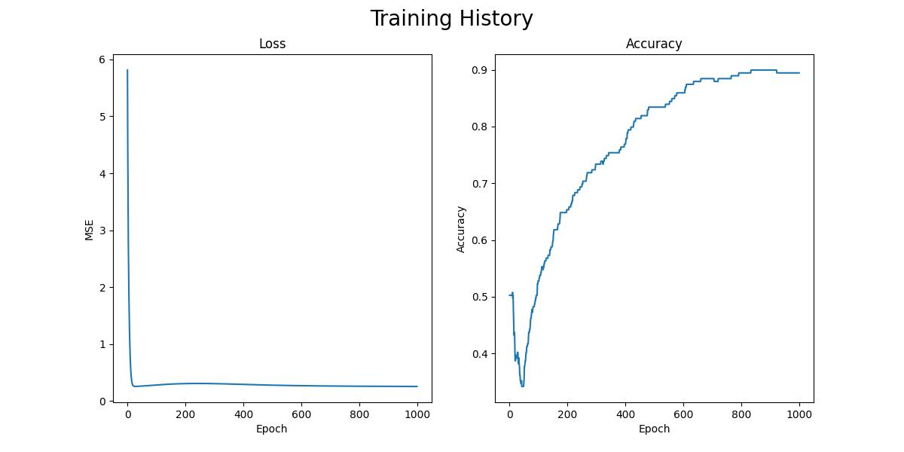
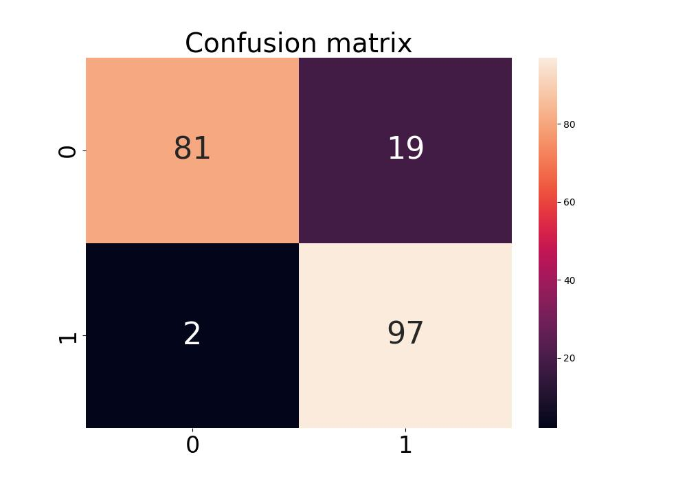
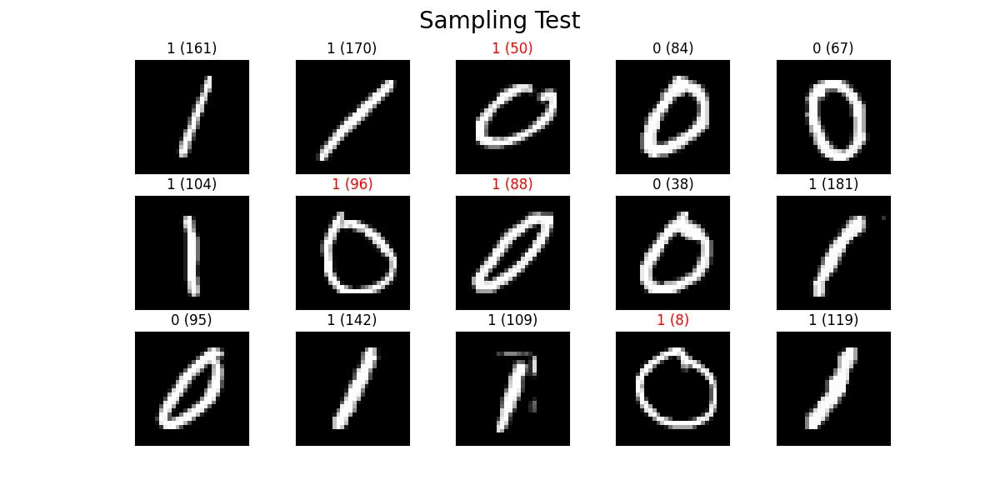

# Convolutional Neural Network From Scratch

## Introduction
This project is to implement CNN (convolutional neural network) from Scratch. Here we got convolution, max pooling, sigmoid, and dense layer with forward and backward propagation features. I plotted line charts and a confusion matrix to visualise the training history and inference results and randomly chose 15 samples to make predictions.

The idea is inspired by Youtube video [*"Convolutional Neural Network from Scratch | Mathematics & Python Code"*](https://www.youtube.com/watch?v=Lakz2MoHy6o) from The Independent Code, which gave me a better understanding of how CNN is constructed.

## Experiment Results
The dataset is sorted by file name; each number has 100 samples. Since **I only wanted to classify 0 and 1**, I decided to pick first 200 files from dataset (it's order).

While initializing the network, I set the parameters of the second filter of the CNN as random numbers from the range -1 to 1. And to reproduce the same result as my example, I set a fixed random seed.

Originally, I set the learning rate as 0.001, but the accuracy decreases as the epochs increase, it's because the learning rate is too large. So I set it to 0.0001 to fixed such a problem. After 1000 epochs, the accuracy is about 89%.

    
### Training history


### Confusion Matrix


### Sampleing Test
The title of each picture is `prediction (filename of the picture)`. It will be red if the prediction is wrong.




## How to use it?
1. Install the dependencies
    ```shell
    pip install -r requirements.txt
    ```
2. Update the `config.py` if needed

3. Update the `model()` in `main.py` if needed
    ```python
    def model():
        return [
            # Input (1, 8, 8), output (2, 8, 8)
            Convolution((1, 8, 8), 3, 2, 1),
            # Input (2, 8, 8), output (2, 4, 4)
            MaxPooling((2, 8, 8), (2, 2), 2, 0, 2),
            Sigmoid(),
            # Input (2, 4, 4), output (2, 4, 4)
            Convolution((2, 4, 4), 3, 2, 1),
            # Input (4, 2, 2), output (2, 2, 2)
            MaxPooling((2, 4, 4), (2, 2), 2, 0, 2),
            Sigmoid(),
            # Input (2, 2, 2), output (8, 1)
            Reshape((2, 2, 2), (2 * 2 * 2, 1)),
            # Input (8, 1), output (8, 1)
            Dense(2 * 2 * 2, 2),
        ]
    ```


4. Run the `main.py`
    ```shell
    python main.py
    ```